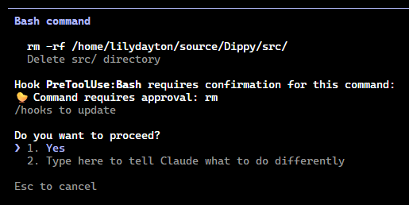

<p align="center">
  
</p>

<h1 align="center">🐤 Dippy</h1>
<p align="center"><em>Because <code>ls</code> shouldn't need approval</em></p>

---

> **Stop the permission fatigue.** Claude Code asks for approval on every `ls`, `git status`, and `cat` - destroying your flow state. You check Slack, come back, and Claude's just sitting there waiting.

Dippy is a [PreToolUse hook](https://docs.anthropic.com/en/docs/claude-code/hooks) that auto-approves safe commands while still prompting for anything destructive. Get up to **40% faster development** without `--dangerously-skip-permissions`.



## ✅ What gets approved

- **Read-only commands**: `ls`, `cat`, `head`, `tail`, `grep`, `find`, `wc`, `stat`
- **Git reads**: `git status`, `git log`, `git diff`, `git branch`
- **Cloud CLI reads**: `aws s3 ls`, `kubectl get`, `gcloud describe`, `az show`
- **Safe tools**: `jq`, `curl` (GET only), `docker ps`, `brew list`

## 🚫 What gets blocked

- **Destructive ops**: `rm`, `mv`, `chmod`, file writes
- **Git mutations**: `git push`, `git commit`, `git reset`
- **Cloud mutations**: `aws s3 rm`, `kubectl delete`, `terraform apply`
- **Anything with output redirects**: `> file.txt`, `>> log`

---

## Add to Claude

Add to `~/.claude/settings.json`:

```json
{
  "hooks": {
    "PreToolUse": [
      {
        "matcher": "Bash",
        "hooks": [
          {
            "type": "command",
            "command": "uv run --directory /path/to/Dippy python -m dippy"
          }
        ]
      }
    ]
  }
}
```

Or use `/hooks` in Claude Code to add interactively.

All decisions are logged to `~/.claude/hook-approvals.log`.

---

## Contributing

PRs welcome! See [prompts/adding-commands.md](prompts/adding-commands.md) for instructions on adding support for new CLI tools.

---

## Uninstall

Remove the hook entry from `~/.claude/settings.json`.

---

<details>
<summary><strong>Claude Instructions</strong></summary>

Structure:
```
src/dippy/
├── dippy.py          # Main router + entry point
├── cli/              # CLI-specific handlers
│   ├── git.py
│   ├── aws.py
│   ├── kubectl.py
│   └── ...
└── core/
    ├── parser.py     # bashlex helpers
    └── patterns.py   # Safe commands and patterns

tests/
├── test_dippy.py     # Integration tests
├── test_simple.py    # Simple command tests
└── cli/              # CLI handler tests
    ├── test_git.py
    ├── test_aws.py
    └── ...
```

Workflow:
1. User pastes "Hook PreToolUse:Bash requires confirmation" output
2. Use `bin/bashlex-dump.py 'command'` to inspect parsing
3. Add pattern to appropriate handler in `src/dippy/cli/`
4. Add test case to `tests/cli/test_*.py`
5. Run `uv run pytest`

</details>
